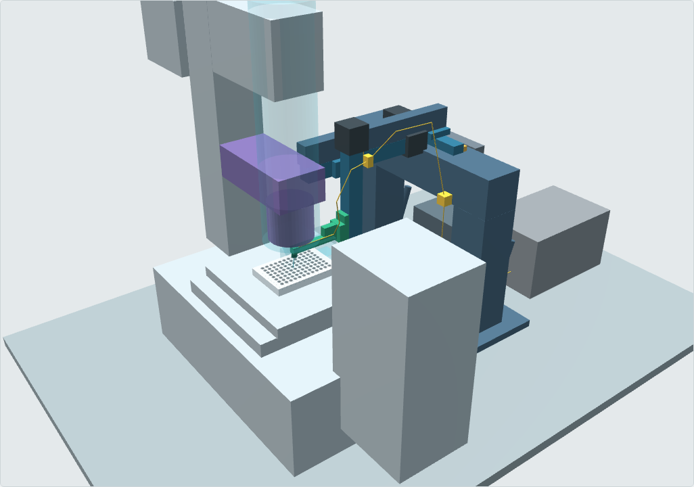

<!-- GENERATED from README.src.md by cad/render_docs.py - edit the source, not this file -->
# picker_: external XYZ capillary picker for an Evident/Olympus IX73

Stage 1 is a **spatial and mechanical feasibility study**: architecture, placement, travel, actuator stacking, capillary approach, interference with the microscope, and 96-well compatibility. There is no control software and there are no manufacturing drawings yet.



## Answer to the main question

> *What is the cleanest mechanically robust way to place an external XYZ capillary picker around an IX73 so that it reliably reaches all wells of a standard 96-well plate without interfering with the microscope?*

**Provisional baseline: workflow W-B plus a side-tower picker.**

- **Workflow W-B.** The IX73 stage, motorised with ≥ 99 × 63 mm travel, brings each source and destination well to the optical axis, so **every pick and dispense is observed** (96/96). This is decision D1; see `docs/09_workflow_D1.md`.
- **Picker.** A side tower bolted to the optical table on the right of the IX73. It is a local XYZ manipulator (100 × 30 × 50 mm, Z with a 1 mm-lead ball screw) whose Z carriage holds a **thin dog-leg arm (115 mm) that reaches under the condenser to a near-vertical (8°) glass capillary**.
- **Independence from the microscope.** Nothing touches the microscope, and the frame unbolts without affecting IX73 alignment.

The stage-fixed alternative **W-A** is kept in the same CAD. Its picker covers the whole plate (150 × 100 mm, arm 175 mm) but observes only 1 well per stage setting.

The layout follows from three constraints found and quantified in this study:

1. **The 96-well limits the angle.** A 1.0 mm capillary reaches the bottom centre of a Corning 7007 U-bottom well (rim Ø6.86 mm, depth 11.30 mm) only within **14.8° of vertical**. At 30° it stops 4.9 mm below the rim, and at 45° 2.7 mm. So 30° and 45° reach **0/96 wells**, whatever the condenser.
2. **A near-vertical capillary must share the optical axis with the condenser.** That fits only under a long-working-distance condenser (**IX-ULWCD, WD 73 mm → 96/96 wells** in W-B, 96/96 in W-A) or with the illumination column tilted back. The IX2-LWUCD (WD 27 mm) and IX2-MLWCD (WD 45 mm) block most positions.
3. **Only the well on the optical axis is seen.** Observed picking of all 96 wells therefore needs the stage to move them there. Evident's IX3-SSU (76 × 52 mm) reaches only 48/96. The manual IX3-SVR (114 × 75) and 120 × 80 motorised stages reach 96/96.

**Freeze gate.** The condenser outline, stage height and eyepiece envelope are placeholders, because the IX73 drawing could not be obtained. The clearances near the condenser (4.83–5 mm) are **not design evidence yet**. Nothing is frozen until M1, M3, M4, M6, M7, M8, M10 and M15 are measured (`docs/05_measurement_checklist.md`).

## Deliverables

| # | Required output | File |
|---|---|---|
| 1 | Editable parametric CAD source | `cad/params.py` (all dimensions with provenance), `cad/model.py` (build123d/OpenCascade) |
| 2 | STEP assembly | `cad/out/assembly_WB_R08_IX-ULWCD.step` (baseline W-B); `assembly_WA_{R08,V00,V30,V45}_IX-ULWCD.step` (W-A and angle comparison); `cad/out/zones_{WA,WB}_IX-ULWCD.step` (travel, safe-Z, keep-out, light cone) |
| 3 | Visual CAD preview | `viewer/ix73_picker_viewer.html`, interactive and self-contained (pick a well, angle, condenser; colour by data confidence) |
| 4–7 | Isometric / top / side / front views | 3D renders in `docs/img/view_{iso,top,front,side,head}.png`; dimensioned views in `docs/img/dim_{top,front,side}.png/.svg` |
| 8 | Travel-envelope visualisation | `docs/img/dim_top.png` (tip XY travel over all 96 wells), zones in the viewer and STEP |
| 9 | Collision / interference notes | `docs/02_approach_angle_study.md` §Collision notes; `docs/generated_analysis_tables.md` |
| 10 | 0° / 30° / 45° (+8°) comparison | `docs/02_approach_angle_study.md`, `docs/img/approach_angles.png` |
| 11 | Actuator architecture comparison | `docs/04_actuator_comparison.md` |
| 12 | Recommended overall architecture | `docs/03_architecture.md`; workflow decision D1: `docs/09_workflow_D1.md`, `docs/img/d1_workflows.png` |
| 13 | Missing IX73 measurements | `docs/05_measurement_checklist.md` |
| 14 | Source manifest | `docs/source_manifest.md`, `references/fetch_references.sh` |
| 15 | Electrical block diagram | `docs/06_electrical.md`, `docs/img/electrical_block_diagram.png` |
| 16 | Assumptions | `docs/07_assumptions_and_open_items.md` |
| 17 | Items NOT to finalise yet | `docs/07_assumptions_and_open_items.md` |
| – | Capillary sizing for 100 µm – 1 mm objects | `docs/08_capillary_sizing.md` |
| – | Plate formats (6–96 well) and exchangeable angle blocks (8° / 20° / 30°) | `docs/10_plate_formats_angle_blocks.md` |
| – | Japanese assembly guide (auto-updated) | `docs/assembly_ja/assembly_guide_ja.html` (`python tools/build_all.py`) |
| – | Literature review (5 papers) | `docs/01_literature_review.md` |
| – | Functional diagram (pump → tubing → capillary; PC → XYZ) | `docs/img/functional_diagram.png` |

## Data confidence

Every dimension in `cad/params.py` carries a status. The viewer's DATA CONFIDENCE mode and the dimensioned drawings use the same colour code:

- **STD / MFR** (green): ANSI/SLAS standards, Evident / Corning / THK / MISUMI / Oriental data.
- **DER / DES** (blue): derived or chosen in this study.
- **APX** (amber): catalogue-class envelope, not a frozen part.
- **PH** (red, hatched): placeholder. Must be measured on the real IX73.

The network policy of the authoring session blocked Zenodo, the publishers, Evident, SLAS and the component vendors. Their values come from search-result excerpts, cross-checked where possible, and are marked as such in the manifest. The two SpheroidPicker GitHub repositories were downloaded and read.

## Rebuild

```bash
pip install build123d matplotlib
python cad/model.py        # STEP + STL + parts.json          (~10 s)
python cad/analysis.py     # well access, light obstruction, 96-well clearance sweep (~4 min)
python cad/views.py        # dimensioned views + diagrams
python cad/render_docs.py  # README.md + docs/*.md from README.src.md + docs/src/*.md
python viewer/build_viewer.py
# or all of the above plus the assembly-guide renders:
python tools/build_all.py            # --fast skips the 8-min clearance sweep
```

`cad/params.py` is the **single source of truth**. Documents are written as templates (`README.src.md`, `docs/src/*.md`) with `{{ KEY }}` numbers from `cad/keynums.py`; edit the templates, never the rendered files. `python cad/render_docs.py --check` fails if a rendered file is stale. Change any value in `params.py` (for example, replace a `PH` with a measured value), rerun, and every figure, table and document number updates.
