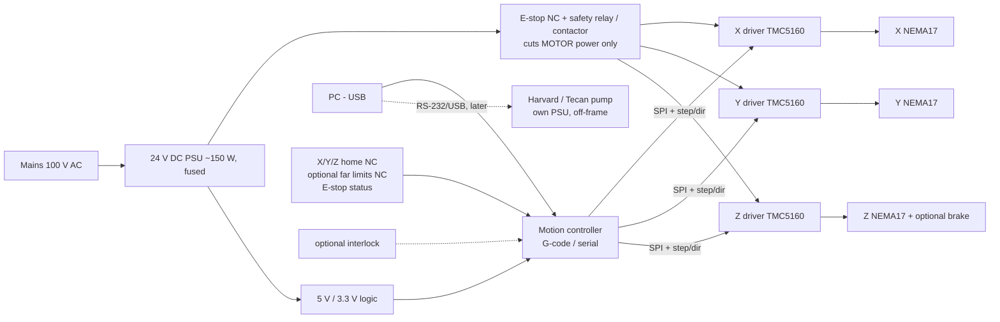

<!-- GENERATED from docs/src/06_electrical.md by cad/render_docs.py - edit the source, not this file -->
# Preliminary electrical architecture (not frozen; no software in this stage)

The main decisions are below.

**Driver class.** TMC5160 rather than TMC2209. The TMC5160 has external MOSFETs, so it runs 24 V NEMA17s at 1.5–2 A with headroom. It has SPI configuration and diagnostics, and stealthChop gives smooth low-speed Z landing. The TMC2209 is adequate electrically for small NEMA17s, but it runs near its thermal limit at 1.5 A and is configured over UART.

**Controller.** Any PC-accessible, G-code-speaking 32-bit motion board that exposes SPI to TMC5160 drivers and ≥6 NC inputs. An industrial alternative is to use the actuator vendor's own drivers, such as the Oriental AZ driver for a DRS2 Z axis. This follows the SpheroidPicker precedent of a G-code serial controller (S28).

**Home switches.** Normally-closed (fail-safe) optical or mechanical micro-switches, at the X outboard end, the Y front end and the Z top. Z homes **upward**, so homing is always a retreat, and Z-top is the safe position.

**Far limits.** Optional NC switches plus firmware soft limits. The actuators' own mechanical end stops are the hard limit.

**E-stop.** It removes motor power through a contactor. Logic stays powered so the controller latches and reports the fault. Z does not fall (see `03_architecture.md` §5).

**Pump.** Keeps its own power supply and controller. Integration with the PC is later work.

**Wiring.** Motor cables shielded; switch cables in separate, twisted pairs; both in the cable chains on the rear side of the moving groups; tubing on the front side (`03_…` §7).
