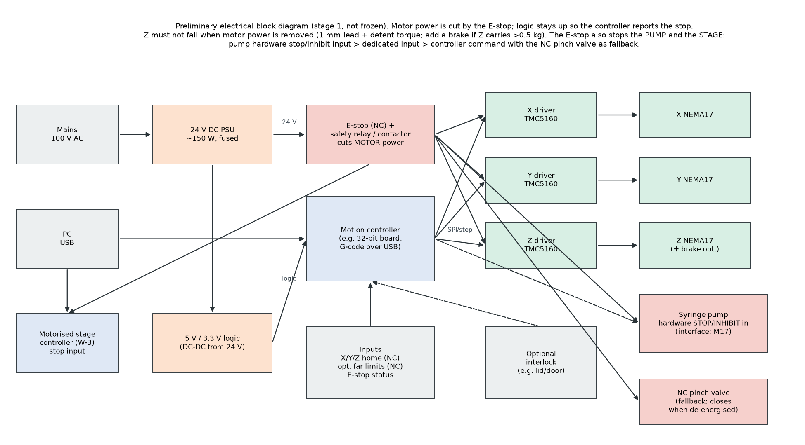
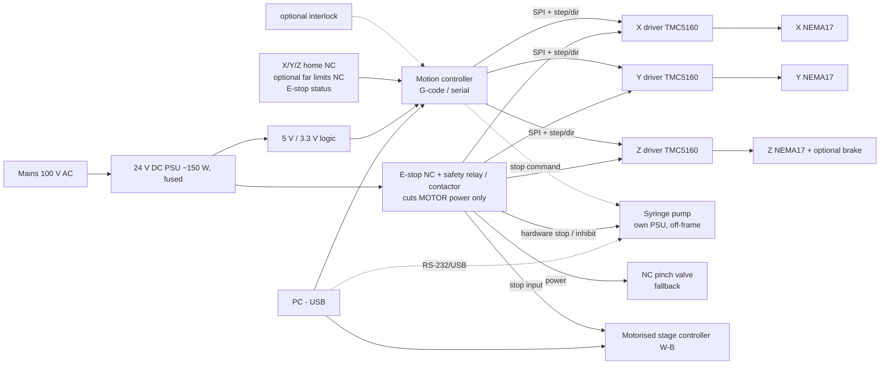

<!-- GENERATED from docs/src/06_electrical.md by cad/render_docs.py - edit the source, not this file -->
# Preliminary electrical architecture (not frozen; no software in this stage)

The main decisions are below.

**Driver class.** TMC5160 rather than TMC2209. The TMC5160 has external MOSFETs, so it runs 24 V NEMA17s at 1.5–2 A with headroom. It has SPI configuration and diagnostics, and stealthChop gives smooth low-speed Z landing. The TMC2209 is adequate electrically for small NEMA17s, but it runs near its thermal limit at 1.5 A and is configured over UART.

**Controller.** Any PC-accessible, G-code-speaking 32-bit motion board that exposes SPI to TMC5160 drivers and ≥6 NC inputs. An industrial alternative is to use the actuator vendor's own drivers, such as the Oriental AZ driver for a DRS2 Z axis. This follows the SpheroidPicker precedent of a G-code serial controller (S28).

**Home and reference switches.** All are normally-closed (fail-safe), so a broken wire reads as "triggered".
- X: outboard end. Y: front end.
- Z: **two switches**.
  - The **reference switch** is one physical switch on the Z body. It trips when the arm bottom is at 59.7 mm above the stage datum, i.e. with the head top 2 mm below the lowest condenser front over all supported plates. It is set from M8 at installation. At that height the arm clears the condenser at every XY. Because the angle blocks change only the tip, not the arm, the same switch serves all heads; the tip lies inside each head's safe-Z corridor: 22.13 / 27.17 / 27.59 mm above the stage top for the 8° / 20° / 30° blocks (corridors in `03_architecture.md` §5).
  - The **top limit switch** is an over-travel stop only. It is *not* a safe position: near the optical axis, Z at the top drives the arm into the condenser.

**Homing order.** Z rises slowly to the reference switch (inside the corridor). X then moves to park (+85 mm, outside the condenser). Only then may Z go higher, and Y homes. After a power loss the tip may still be in a well; this order lifts it vertically out of the well without dragging it sideways and without reaching the condenser. A closed-loop absolute Z (D5, e.g. DRS2) makes this recovery independent of switches.

**Far limits.** Optional NC switches plus firmware soft limits. The actuators' own mechanical end stops are the hard limit.

**E-stop.** It removes motor power through a contactor. Logic stays powered so the controller latches and reports the fault. Z does not fall (see `03_architecture.md` §5). The E-stop must also stop **the pump and the motorised stage**, because a running pump keeps aspirating or dispensing and a moving stage drags the plate under the tip.

**Pump stop on E-stop (issue #8).** The pump keeps its own power supply, but its motion must stop on E-stop. Use the first option the chosen pump supports, in this order:

1. a **hardware stop / inhibit input** on the pump, wired to a spare NC contact of the safety relay;
2. a dedicated digital "stop" or "external trigger" input, driven by the relay;
3. a **controller stop command** over RS-232/USB **plus** a normally-closed pinch valve on the line, powered through the E-stop circuit, so the line is closed when power drops even if the command is lost.

Cutting the pump's mains is the last resort: some pumps lose their position or state and may not stop the plunger cleanly. M17 records which interface the lab's pump offers.

**Motorised stage on E-stop (W-B).** The stage controller's stop/enable input is wired to the relay the same way. If it has none, the stage motor supply is switched by the contactor.

**Restart and recovery.** Releasing the E-stop does not restart anything. The operator acknowledges the fault on the PC. The controller then re-homes Z to the reference (tip vertically out of the well), X to park, then Y. The pump is re-enabled last, after the tubing and the capillary have been inspected. A capillary that was in a well at the stop is treated as possibly broken (see break-away below).

**Break-away mount is a kinematic repositioner, not a force limiter.** The magnetic kinematic mount under the arm lets the arm come off in a crash and go back on to about the same place. It does **not** limit the force on the capillary: at a hold force of about 16 N it releases at about 1.67 N at the tip, above the estimated lateral breaking force of every capillary class (0.15–1.18 N). It does protect the plate (below 5 N, placeholder):

| Capillary | OD / ID | Lateral break force at the tip (est.) | Mount release force at the tip | Capillary protected | Plate protected |
|---|---|---|---|---|---|
| S  (100-300 um) | 1.00 / 0.58 | 0.15 N | 1.67 N | **no** | yes |
| M  (300-600 um) | 1.50 / 0.84 | 0.50 N | 1.67 N | **no** | yes |
| L  (600-800 um) | 2.00 / 1.12 | 1.18 N | 1.67 N | **no** | yes |
| L' (800-1000 um) | 2.00 / 1.56 | 0.82 N | 1.67 N | **no** | yes |

Capillaries are therefore consumables in a crash. If the capillary itself must survive, a compliant or low-force stage is needed at the holder (a spring-loaded flexure that deflects at well below 0.15 N), or current/torque-limited Z landing with contact detection. This is left open (not V1).

**Wiring.** Motor cables shielded; switch cables in separate, twisted pairs; both in the cable chains on the rear side of the moving groups; tubing on the front side (`03_…` §7).
