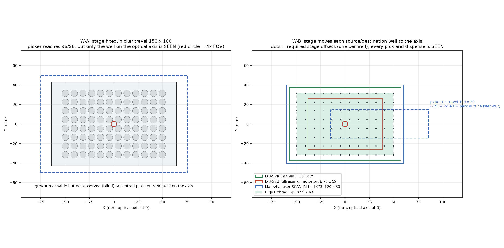

<!-- GENERATED from docs/src/09_workflow_D1.md by cad/render_docs.py - edit the source, not this file -->
# D1: which workflow? Stage fixed (W-A) vs stage moves wells to the axis (W-B)

## Conclusion

If the requirement is **"pick from any of the 96 wells while watching it through the IX73"**, then **W-B is the baseline**. The IX73 stage brings the source well to the optical axis, the picker picks at the axis, and the stage then brings the destination well to the axis for an observed dispense. W-A (stage fixed, picker reaches every well) can *reach* all 96 wells but can *see* only the well on the optical axis. It observes 1 well per stage setting, and none at all with a centred plate. W-A stays valid only if the non-axis wells are served blind or by a separate overview camera.

This is a provisional choice. **Nothing is frozen until M1, M3, M4, M6, M7, M8, M10, M15, M23 are measured** (see "Freeze gate" below).

## Why (numbers from the same CAD and analysis)

| | W-A stage fixed | W-B stage moves wells to the axis |
|---|---|---|
| Wells observed while picking | **1** / 96 per stage setting (4× FOV ≈ 5.5 mm) | **96** / 96 with IX3-SVR or SCAN IM |
| Dispense | blind, anywhere the picker reaches | observed, same plate (stage brings the destination to the axis) |
| Picker tip travel X × Y × Z | 150 × 100 × 50 mm | 100 × 30 × 50 mm (X -15…+85: +X is the park / capillary-change retreat) |
| Dog-leg arm / thin section under the condenser | 180 / 120 mm | **120 / 60 mm** (shorter, stiffer) |
| Tower axis from optical axis | +408 mm | +368 mm |
| Clearance sweep, R08 head, IX-ULWCD: pick / safe-Z | 96/96, 96/96 | 96/96, 96/96 (plate and stage translated for each well) |
| Stage-travel corners (stage moves with tip at safe-Z) | – | 9/9 clear |
| Min clearance at safe-Z (PH condenser) | 4.83 mm | 4.83 mm |
| Needs a motorised IX73 stage for automation | no | **yes, with ≥ 99 × 63 mm travel** |
| Extra hardware for observation | an overview camera for the non-axis wells | none |

**Stage requirement for W-B.** The plate's well span is 99 × 63 mm, so the stage must shift the plate by at least ±49.5 × ±31.5 mm:

| Stage | Travel (mm) | Motorised | Wells it can bring to the axis |
|---|---|---|---|
| IX3-SVR (manual, S02) | 114 × 75 | no | 96/96 (operator moves it: semi-automatic only) |
| IX3-SSU (Evident ultrasonic, S01) | 76 × 52 | yes | **48/96: insufficient** |
| Märzhäuser SCAN IM for IX73 (S15) | 120 × 80 | yes | 96/96 |

Evident's own ultrasonic IX3-SSU stage **cannot** bring the outer columns and rows to the axis. A W-B automation therefore needs a third-party (or other Evident) motorised stage in the 120 × 80 mm class, such as the Märzhäuser SCAN IM (2 mm pitch ball screw, per S15), or a semi-automatic mode on the manual IX3-SVR.

## Consequences of choosing W-B

1. **The picker becomes a local manipulator.** Its travel falls to 100 × 30 × 50 mm, and the arm shortens from 180 to 120 mm. The frame, the Y beam and the X cantilever all get smaller, and moving mass drops, mostly on Y. The dog-leg under the IX-ULWCD is still needed, because the pick still happens on the optical axis.
2. **Plate and stage load.** The picker never touches the stage. The motorised stage carries only the plate, well within its rating (IX3-SVR: max 1000 g, S02; check the chosen motorised stage).
3. **Sequence.** Stage: source well → axis. Z: land at about 10 µm/s and pick. Z: rise to safe-Z (19.35 mm). Stage: destination well → axis. Z: land and expel. Z: safe-Z. **The stage moves only with the tip at safe-Z**; the sweep confirms this is clear at all stage-travel corners. Moving it with the tip at pick height drags the capillary through the plate.
4. **Calibration** simplifies. The pick point is always the optical axis, so image → picker mapping needs only a local 3-point calibration around the axis (SpheroidPicker method, S28). Well positions come from the stage coordinates.
5. **Destination on another plate.** Two plates do not fit within the stage travel. Transfers between plates need either a plate change, or a hybrid (W-C, not modelled) where the picker carries the object at safe-Z to a fixed destination station beside the stage. W-C brings back W-A's long X travel for that one move.
6. **Throughput.** Each transfer adds two stage moves (about 1–2 s each at typical 20–50 mm/s stage speeds; to be confirmed for the chosen stage). The landings take longer. At 10 µm/s, a 50 µm slow zone costs 5 s per landing, or about 10 s per transfer. The SpheroidPicker also dwells 7 s before its pick pulse (S28). One transfer therefore takes roughly 20–30 s, which is acceptable for spheroid picking. The landings, not the stage, set the pace.

## When W-A is still the better choice

- There is no budget or space for a motorised stage, the source objects sit only in a few wells placed near the axis, and destinations can be served blind.
- A separate overview camera can image the whole plate from above (off-axis, outside the condenser keep-out), giving target coordinates for blind picking. That trades the IX73's optical quality at the pick for coverage.

## Freeze gate

The following must be measured and entered in `cad/params.py` before any part number or bracket is frozen. The model, the sweep and these documents then re-render automatically (`python tools/build_all.py`).

| Measurement | Decides |
|---|---|
| M1 stage-top height above table | frame height |
| M3 stage outline, clips; M4 stage centre vs axis | clearance to the moving plate (W-B) |
| M6 condenser model and diameter; M7 carrier arm; M8 real condenser front height | the thin-arm length, and every clearance currently at ~5 mm |
| M10 tilted-column envelope | fallback without condenser |
| M15 free table space right of the IX73 | tower placement |
| (W-B) choice and envelope of the motorised stage | stage travel ≥ 99 × 63, clearance to the tower |

The clearances of 4.83–5 mm reported by the model involve placeholder condenser geometry. **They are not design evidence yet.**
