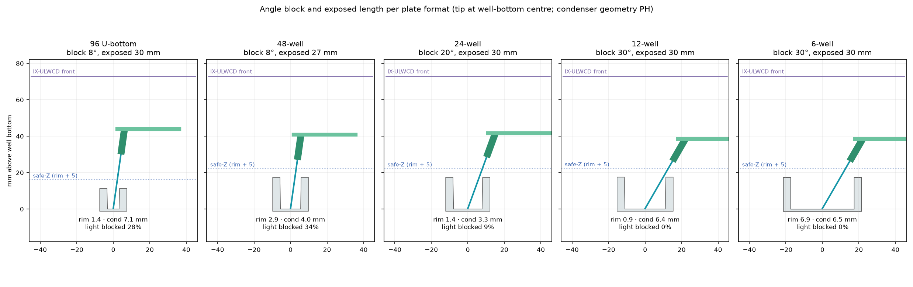

<!-- GENERATED from docs/src/10_plate_formats_angle_blocks.md by cad/render_docs.py - edit the source, not this file -->
# Plate formats and exchangeable angle blocks

## Conclusion

**Scope.** Only the **Corning 7007** 96-well U-bottom plate with the 8° block is V1. The 8° head is designed for that SKU: other 96-well plates have different rim diameters and depths and must be re-checked before use. Everything else on this page (48-well (Corning 3548), 24-well (Corning 3524), 12-well (Corning 3513), 6-well (Corning 3516)) is **experimental**: kept in the model to show that the frame can grow, but not part of V1 acceptance or ordering. Plate heights of the experimental plates are not confirmed (`MULTIWELL_HEIGHT_EXTRA`, placeholder).

A single fixed capillary angle serves the 96-well plate well but not the larger wells. The holder therefore takes **exchangeable angle blocks (8° / 20° / 30°)**. The block sits in the **holder seat at the tip end of the arm**, not at the kinematic mount on the Z carriage, so it tilts only the holder and capillary. For each plate format and capillary class, the collet's depth stop sets the **exposed capillary length**. Each block is a fixed, pre-designed geometry, which is more repeatable than a continuous tilt. A block change only needs a 3-point image re-calibration and that plate's soft limits.

## Recommended setting per plate format and capillary class

Computed by `analysis.format_angle_matrix()`. A setting is accepted when all of the following hold:

- rim clearance ≥ 0.5 mm (well geometry is manufacturer data);
- holder over plate material ≥ 2 mm;
- a positive safe-Z corridor: the head top (arm plus tubing) stays ≥ 2 mm under the condenser front with the tip at that plate's corridor lower bound (the condenser is still a placeholder);
- for flat-bottom wells, the tip can reach ≥ 50 % of the bottom area.

Among the settings that pass, the one that blocks the least transmitted light (holder plus arm, ray test at NA 0.3) is chosen. Ties go to the larger reachable area, then the longer exposed length.

| Plate | Capillary class | Angle block | Exposed length | Rim clearance | Head under condenser at safe-Z | Reachable bottom | Light blocked (NA 0.3) | Note |
|---|---|---|---|---|---|---|---|---|
| 96 U-bottom | S (OD 1.0) | 8° | 30 mm | 1.38 mm | 4.8 mm | centre (U-bottom) | 33% |  |
| 96 U-bottom | M (OD 1.5) | 8° | 30 mm | 1.13 mm | 4.8 mm | centre (U-bottom) | 33% |  |
| 96 U-bottom | L (OD 2.0) | 8° | 30 mm | 0.87 mm | 4.8 mm | centre (U-bottom) | 33% |  |
| 48-well | S (OD 1.0) | 8° | 24 mm | 2.87 mm | 4.7 mm | 54% | 43% |  |
| 48-well | M (OD 1.5) | 8° | 24 mm | 2.62 mm | 4.7 mm | 48% | 43% | reach 48% < 50%; a 0° block would reach 67% but blocks 62% of the light (D8) |
| 48-well | L (OD 2.0) | 8° | 24 mm | 2.37 mm | 4.7 mm | 42% | 43% | reach 42% < 50%; a 0° block would reach 60% but blocks 62% of the light (D8) |
| 24-well | S (OD 1.0) | 8° | 24 mm | 5.22 mm | 4.7 mm | 67% | 43% |  |
| 24-well | M (OD 1.5) | 8° | 24 mm | 4.97 mm | 4.7 mm | 62% | 43% |  |
| 24-well | L (OD 2.0) | 8° | 24 mm | 4.72 mm | 4.7 mm | 57% | 43% |  |
| 12-well | S (OD 1.0) | 20° | 27 mm | 4.57 mm | 3.7 mm | 56% | 14% |  |
| 12-well | M (OD 1.5) | 20° | 27 mm | 4.33 mm | 3.7 mm | 52% | 14% |  |
| 12-well | L (OD 2.0) | 8° | 24 mm | 7.94 mm | 4.6 mm | 69% | 43% |  |
| 6-well | S (OD 1.0) | 30° | 30 mm | 6.98 mm | 4.2 mm | 57% | 0% |  |
| 6-well | M (OD 1.5) | 30° | 30 mm | 6.76 mm | 4.2 mm | 55% | 0% |  |
| 6-well | L (OD 2.0) | 30° | 30 mm | 6.55 mm | 4.2 mm | 53% | 0% |  |

Full matrix: `generated_analysis_tables.md` §1c.

## What the matrix shows

1. **Well depth, not diameter, drives the condenser margin.** The 48/24/12/6-well plates are about 17.4 mm deep, against 11.3 mm for the 96-well. Retracting to safe-Z (rim + 5 mm) therefore lifts the head about 6 mm higher under the condenser. A shorter exposed length or a steeper block restores the margin.
2. **Head height above the nose is the most sensitive dimension.** It is defined once, as the vertical distance from the collet nose to the highest point of the head (holder, arm and tubing), and measured as M23 (`HEAD_TOP_FROM_NOSE_MEAS`). The model uses 22.2 mm for the V1 head (holder axial length 14 mm, APX). Every recommended setting keeps at least 2 mm under the condenser only if this height is no more than about **22.6 mm**. An ER8-collet holder with nut, depth stop and seal is likely 20–25 mm long (P10, unverified), so M23 is a **freeze-gate item**. The exported CAD heads are checked against the same formula (`generated_analysis_tables.md` §5d). Mitigations:
   - shorter exposed length (24 mm);
   - a holder that passes *through* the arm, so its top is the head top;
   - the tilted-back illumination option.
3. **Steeper blocks trade light for reach.** At 30° the head casts no shadow at NA 0.3, but a tilted shaft cannot follow objects near the far (+X) wall. That is why the reachable bottom area is an acceptance criterion.
4. **Stand-off must account for the tilted tip.** For a square-cut tip, the lowest edge lies r·sin θ below the tip axis. The tip-axis height tz is therefore raised so that the edge stays ≥ 0.1 mm above the bottom: 0.47 mm for OD 1.5 at 30°, 0.60 mm for OD 2.0. The firmware Z floor must be set per plate × block × capillary class from the *measured* bottom height, never below it.
5. **Some combinations fall short.** The 48-well with OD 1.5/2.0 reaches under 50 % of the bottom at 8°. A 0° block would reach more but blocks most of the light. That choice is left open as D8.
6. **45° is not needed.** In the 6-well the shaft almost touches the rim and the holder nose runs about 0.6 mm above the plate material. In smaller wells the rim blocks it outright.

## Mechanical design intent for the blocks

- The block sits between the arm tip and the holder seat, with two dowels and one clamp screw. Each block carries an engraved angle.
- Changing the block moves the tip relative to the arm by several mm: 44·(cos 8° − cos 30°) ≈ 5.5 mm in height, plus the change in exposed length. Soft limits, the Z floor and the image calibration are therefore stored **per plate × block × capillary class**.
- W-B only: the dog-leg arm and all other parts are unchanged, and the Y/X travel does not depend on the angle.

## Data status

- Plate dimensions are Corning dimension-sheet values read from search excerpts (S13, S16). The 6-well gives a single diameter (34.8 mm), and the 24-well pitch (19.3 mm) is only weakly confirmed.
- Condenser clearance uses the placeholder condenser geometry and must be recomputed after M6 and M8. It also depends one-for-one on the head height above the nose (M23, see 2).
