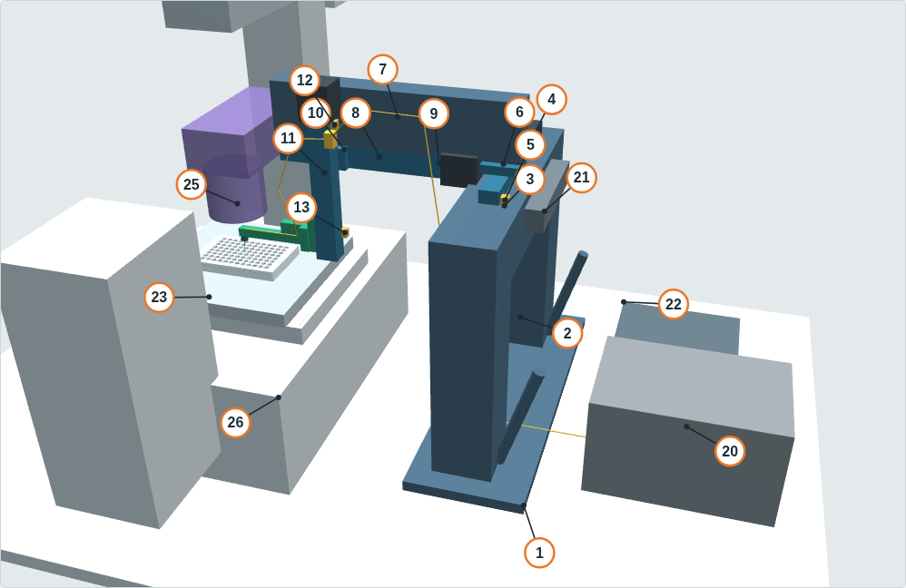
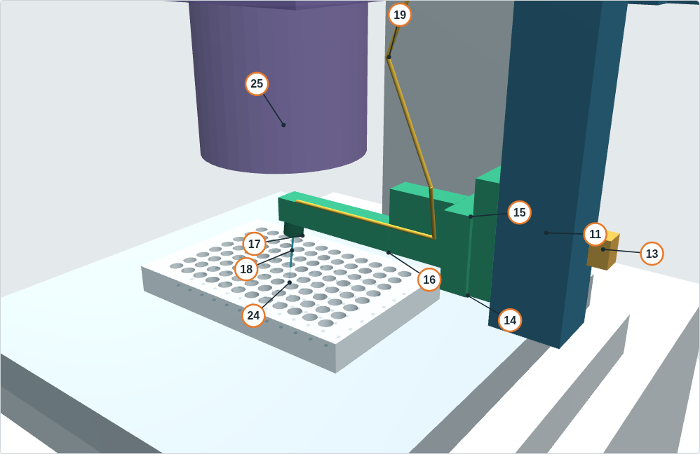

<!-- GENERATED by docs/parts/build_partmap.py from docs/parts/part_map.py - edit part_map.py -->
# 部品の対応表(どこの部品が何に当たるか)

図の番号 1–27 が、実物の部品、CAD のパーツ名、部品候補リストの番号(P01–P42)、組立工程、関係する実測項目をつなぎます。W-B(ステージが動く)構成、8° ヘッド、IX-ULWCD の状態で描いています。番号はこの表と図で共通です。

全体図では架台、3 軸、電装、顕微鏡側に番号を付け、ヘッド周り(14–19、24)は拡大図に付けています。20 と 22 は定盤の上、架台の外側に置く箱(ポンプと制御箱)です。

## 対応表

区分は、製作 = 図面を起こして作る、購入 = 市販品を買う、既存 = 研究室にあるものを使う、顕微鏡 = 顕微鏡側の機器(ピッカーとしては作らない)です。

| 番号 | 部品 | 役割 | 区分 | 部品候補(P) | 組立 | 関係する実測など | CAD のパーツ名 |
|---|---|---|---|---|---|---|---|
| 1 | ベース板 | 架台全体を定盤に固定する土台。長穴で位置と向きを調整する | 製作 | P16, P37 | 工程 1 | M15, M16 | `base_plate` |
| 2 | 支柱と筋交い | Y 梁を必要な高さに支える 2 本の柱 | 購入 | P17, P20 | 工程 2 | M1 | `post_*, post_brace_*` |
| 3 | Y 梁 | 両端で支えた固定梁。Y ステージを載せる | 購入 | P18 | 工程 3 | M1 | `y_beam` |
| 4 | Y ステージ | 先端を Y(奥行き)方向に動かす軸 | 購入 | P03, P04, P06 | 工程 4 | モーメント(03 §5b) | `Y_actuator_body, Y_motor` |
| 5 | Y 原点スイッチ | Y の原点(手前側端) | 購入 | P30 | 工程 4 | — | `Y_home_switch` |
| 6 | Y キャリッジ | Y ステージの可動台。X 支持梁を載せる | 製作 | P15 | 工程 5 | — | `Y_carriage` |
| 7 | X 支持梁 | Y キャリッジから光軸側へ張り出す片持ち梁 | 購入 | P19 | 工程 5 | M7 | `X_support_beam` |
| 8 | X ステージ | 先端を X(左右)方向に動かす軸。待避位置もこの軸 | 購入 | P02, P04, P06 | 工程 5 | — | `X_actuator_body, X_motor` |
| 9 | X 原点スイッチ | X の原点(外側端) | 購入 | P30 | 工程 5 | — | `X_home_switch` |
| 10 | X キャリッジブラケット | X の可動台に Z ステージを鉛直に固定する | 製作 | P15 | 工程 6 | — | `X_carriage_bracket` |
| 11 | Z ステージ | 先端を上下させる軸。着地精度と停電時に落ちないことが要 | 購入 | P01, P05, P06 | 工程 6 | — | `Z_actuator_body, Z_motor` |
| 12 | Z 上端リミットスイッチ | 行き過ぎ防止のみ。安全な位置ではない | 購入 | P30 | 工程 6 | — | `Z_home_switch_top` |
| 13 | Z 基準スイッチ | Z の原点。ヘッド最上部がコンデンサ下端より余裕を残す高さ(1 個だけ) | 購入 | P42 | 工程 6 | M8, M23 | `Z_reference_switch` |
| 14 | Z キャリッジ | Z ステージの可動台。マウントとアームを付ける | 製作 | P15 | 工程 6 | — | `Z_carriage` |
| 15 | キネマティックマウント | 衝突で外れ、同じ位置に戻る(力の制限ではない) | 購入 | P12 | 工程 7 | — | `breakaway_kinematic_mount` |
| 16 | ドッグレッグアーム | コンデンサの下へ差し込む薄い腕。Z 本体を光軸の外に置く | 製作 | P14 | 工程 7 | M6, M7, M8 | `arm_deep, arm_thin` |
| 17 | キャピラリホルダーと角度ブロック | コレットでキャピラリをつかみ、ブロックで傾き(8°/20°/30°)を決める | 製作 | P10, P11, P13 | 工程 7 | M23 | `capillary_holder_collet` |
| 18 | ガラスキャピラリ | 対象物を吸う先端。対象の大きさで太さを選ぶ(消耗品) | 購入 | P21, P22, P23, P24 | 工程 10 | — | `glass_capillary_OD1.0` |
| 19 | チューブとクランプ | ポンプからキャピラリまでの液の経路。サービスループで動きを逃がす | 購入 | P25, P26 | 工程 9 | — | `tubing_clamp_Zbody, tubing_fixed_clamp, tubing_head_*, tubing_loopXY_*, tubing_loopZ_*, tubing_to_pump_*` |
| 20 | シリンジポンプ | 吸引と吐出。架台には載せない | 既存 | P38, P40, P27, P41 | 工程 9 | M17 | `syringe_pump_existing` |
| 21 | ケーブルチェーン | モーターとスイッチの配線を可動部の奥側で逃がす | 購入 | P34, P35 | 工程 8 | — | `X_cable_chain, Y_cable_chain` |
| 22 | 制御箱 | コントローラ、ドライバ、24 V 電源、非常停止回路 | 購入 | P28, P29, P31, P32, P33, P36 | 工程 8 | — | `motion_controller_24V` |
| 23 | 電動 XY ステージとプレートホルダー | W-B でウェルを光軸へ運ぶ(ピッカーは触れない) | 顕微鏡 | P07, P08, P39 | — | M3, M4 | `ix73_stage` |
| 24 | 96 穴プレート(Corning 7007) | V1 の対象プレート。蓋は外して使う | 既存 | — | — | M19 | `plate_96_SLAS` |
| 25 | コンデンサ(IX-ULWCD)と保持アーム | 透過照明。アームはこの下を通る | 顕微鏡 | P09 | — | M6, M7, M8 | `condenser_IX-ULWCD, condenser_carrier_arm, illum_arm_to_pillar` |
| 26 | IX73 本体(外形の目安) | 位置関係を見るための仮の外形。寸法は実測で置き換える | 顕微鏡 | — | — | M1, M5, M9, M12–M14 | `ix73_body_lower, ix73_illum_pillar, ix73_lamp_house, ix73_objective_zone, ix73_obs_tube_eyepieces, ix73_stage_handle, ix73_stage_support, optical_table_patch` |
| 27 | 比較用の外形 | 別のコンデンサと、照明支柱を倒した状態。比較のためだけに表示 | 顕微鏡 | — | — | M10 | `condenser_IX2-LWUCD, condenser_IX2-MLWCD, illum_arm_tilted_back` |

## 部品候補の番号から引く

発注や見積のときに、部品候補リスト(`12_parts_candidates.md`)の番号から図の番号を引くための表です。

| 部品候補 | 分類 | 品目(候補リストの表記) | 図の番号 |
|---|---|---|---|
| P01 | Actuator | Z stage (vertical, landing axis) | 11 |
| P02 | Actuator | X stage (cantilevered, tip X) | 8 |
| P03 | Actuator | Y stage (on fixed Y beam) | 4 |
| P04 | Motor | NEMA17 stepper motors, X and Y | 4, 8 |
| P05 | Motor | NEMA17 stepper motor for Z (optional brake) | 11 |
| P06 | Mechanical | Motor brackets + shaft couplings | 4, 8, 11 |
| P07 | Microscope | Motorised XY stage for IX73 (W-B) | 23 |
| P08 | Microscope | Stage controller + joystick | 23 |
| P09 | Microscope | IX-ULWCD long-working-distance condenser (if not owned) | 25 |
| P10 | Capillary holder | Collet capillary holder (custom) with inserts OD 1.0/1.5/2.0 | 17 |
| P11 | Capillary holder | Commercial pipette holder with side port (reference/spare, 1.0-2.0 mm) | 17 |
| P12 | Mechanical | Kinematic magnetic break-away mount (Z carriage <-> arm) | 15 |
| P13 | Mechanical | Exchangeable angle blocks 8 / 20 / 30 deg | 17 |
| P14 | Mechanical | Dog-leg arm (115 mm, 12x12 thin section) | 16 |
| P15 | Mechanical | Carriage brackets (X carriage->Z body, Y carriage->X beam), tubing clamps | 6, 10, 14 |
| P16 | Frame | Base plate, 15 mm aluminium, slotted for table grid | 1 |
| P17 | Frame | Posts, aluminium extrusion 80x80 | 2 |
| P18 | Frame | Y beam, aluminium extrusion 80x80, ~390 mm | 3 |
| P19 | Frame | X support beam, aluminium extrusion 40x80 (cantilever) | 7 |
| P20 | Frame | Extrusion fasteners: brackets, post-assembly nuts, diagonal braces, jack screw | 2 |
| P21 | Consumable | Glass capillaries class S: OD 1.0 / ID 0.58 | 18 |
| P22 | Consumable | Glass capillaries class M: OD 1.5 / ID 0.84-0.86 | 18 |
| P23 | Consumable | Glass capillaries class L: OD 2.0 / ID 1.12 | 18 |
| P24 | Consumable | Glass capillaries class L': thin wall OD 2.00 / ID 1.56 | 18 |
| P25 | Fluidics | PTFE/FEP tubing 1/16" OD | 19 |
| P26 | Fluidics | Fittings 1/4-28 flat-bottom for 1/16" tubing (+ferrules, unions) | 19 |
| P27 | Fluidics | Pump interface: Luer to 1/4-28 adapter (Harvard) / direct 1/4-28 (Tecan Cavro) | 20 |
| P28 | Electronics | Motion controller (G-code / serial, >=3 axes, >=6 NC inputs) | 22 |
| P29 | Electronics | TMC5160 stepper drivers (only if controller has sockets) | 22 |
| P30 | Electronics | Home switches, NC / fail-safe (X out, Y front, Z top) + optional far limits | 5, 9, 12 |
| P31 | Electronics | 24 V DC PSU (~150 W) | 22 |
| P32 | Safety | E-stop push button (2NC) | 22 |
| P33 | Safety | Safety relay / contactor cutting motor 24 V (logic stays on) | 22 |
| P34 | Wiring | Cable chains (X on Y group; Y on frame) | 21 |
| P35 | Wiring | Motor (shielded) and switch (twisted pair) cables, chain-rated | 21 |
| P36 | Electronics | Enclosure, DIN rail, fuses, terminal blocks, USB cable | 22 |
| P37 | Frame | Table mounting hardware | 1 |
| P38 | Fluidics | Syringe pump (existing Harvard or Tecan) - no purchase | 20 |
| P39 | Microscope | SBS plate insert / holder for the motorised XY stage | 23 |
| P40 | Fluidics | Syringe for the existing pump (gas-tight) | 20 |
| P41 | Fluidics | Optional pinch/NC valve and pressure tee on the fixed side | 20 |
| P42 | Electronics | Z reference switch (below the condenser) | 13 |

## この表の保ち方

対応は `docs/parts/part_map.py` の一か所だけに書いてあります。組立工程の割り当てもここにあり、ビューアの工程図もここから作ります。`python tools/build_all.py --check` と CI のテストは、W-B の CAD パーツがどれか一つの番号にだけ入っていること、部品候補 P01–P42 がすべてどこかの番号に入っていることを確かめます。部品を増やしたら、`part_map.py` に一行足して再生成してください。
