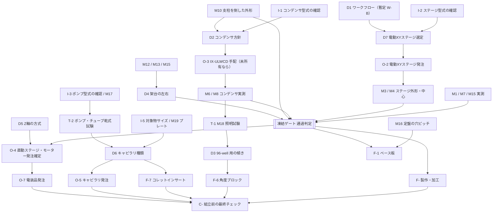

# 組立前にやること(IX73 外付けキャピラリピッカー)

この文書は、組立手順書(`docs/assembly_ja/assembly_guide_ja.html`)の**前段**にあたる作業リストです。手元の機材の確認、実測、試験、決定、発注、製作を、依存関係の順に並べています。組立工程そのもの(工程 1–10、立ち上げと校正)は手順書にあり、ここでは繰り返しません。

- 前提ワークフローは **W-B(暫定)** です。ステージが各ウェルを光軸へ運び、ピッカーは光軸付近だけを動きます(`docs/09_workflow_D1.md`)。
- 文中の数値は、現時点の `cad/params.py` から描画された文書(`docs/03`, `05`, `07`–`10`)からの引用です。この文書の数値は自動更新されません。`params.py` を更新したら、元の文書の数値と照合してください。
- 納期、価格、在庫はリポジトリに情報がありません。見積時に確認します。
- 部品の候補は `docs/12_parts_candidates.md`(元データ `docs/parts/candidates.csv`)の P-番号で参照します。候補は検索結果の抜粋に基づくもので、型番・価格・納期は見積時に確認します。
- 各項目の「担当: ___ / 時期: ___」は空欄のまま配っています。記入して使ってください。

記号: ☐ = 未完了(完了したら ☑ に書き換える)。項目 ID は M-/D- がリポジトリの ID です。I-(在庫確認)、T-(試験)、O-(発注)、F-(製作)、C-(最終チェック)はこの文書だけの番号です。

---

## まずこれだけ(最初の 8 件)

| 順 | ☐ | やること | これで決まる / 解除されること | 参照 |
|---|---|---|---|---|
| 1 | ☐ | 手元のコンデンサの型式を確認する(IX-ULWCD / IX2-LWUCD / IX2-MLWCD / その他)(I-1, M6) | IX-ULWCD を手配するかどうか(D2)。M8 と M18 を実施できるか | `05` M6, `02` |
| 2 | ☐ | 手元のステージの型式を確認する(IX3-SVR / IX3-SSU / 他社電動)(I-2) | 電動 XY ステージを新規に手配するか(D7)。IX3-SSU(76 × 52 mm)では 48/96 しか光軸に運べない | `09` |
| 3 | ☐ | 手元のポンプの型式、ポート、通信方式、**外部停止(インヒビット)入力の有無**を確認する(I-3, M17) | シリンジ容量、チューブ、D6 | `05` M17, `08` |
| 4 | ☐ | 凍結ゲートの実測のうち、今の機材で測れるものを測る: M1, M3, M4, M7, M10, M15 | 支柱高さ、架台位置、X 支持梁の余裕 | `05` |
| 5 | ☐ | 電動 XY ステージ(IX73 用、移動量 ≥ 99 × 63 mm)と IX-ULWCD(持っていない場合)の**見積と納期を問い合わせる**(O-1) | 長納期品の見通し。発注の時期 | `09`, `07` D2/D7 |
| 6 | ☐ | IX-ULWCD を手元に用意する(所有品、借用、または購入)。そのうえで M6(外径・外形)と M8(ピント状態の前玉高さ)を測る。ホルダーの試作品か購入品で M23(コレット先端 → ヘッド最上点の鉛直距離)も測る。V1 プレート {{V1_PLATE_SKU}} の実物で M19 も測る | 凍結ゲートの残り項目。アームの細い部分の長さ、コンデンサとの余裕 | `05` M6/M8 |
| 7 | ☐ | M18 照明試験を行う(T-1) | 96-well 用の傾き 8° のままでよいか、10–12° にするか(D3) | `05` M18, `02` |
| 8 | ☐ | 実測値を `cad/params.py` に入れ(状態を `PH` → `MEAS`)、全体を再計算して干渉結果を確認する(C-1 の先取り) | 凍結ゲートの通過判定。これ以前は製作・発注確定に進まない | `05` 冒頭, README |

---

## 凍結ゲート

> **凍結ゲート({{FREEZE_GATE_N}} 項目): {{FREEZE_GATE}}**
>
> この {{FREEZE_GATE_N}} 項目を実測して `cad/params.py` に入れ、再計算するまで、ブラケット形状、部品型番、加工図を確定しません(`05_measurement_checklist.md`、`07_assumptions_and_open_items.md`)。W-B では、選んだ電動 XY ステージの外形と移動量もあわせて記録します(`05` 冒頭、`09` 凍結ゲート表)。
>
> 現在のモデルのコンデンサ付近の余裕(安全高さで {{SW_WB_R08_ULWCD_SAFE_CLEAR}} mm)は、仮のコンデンサ外形(Ø80 mm)から出た値です。**設計根拠ではありません。**

注意:

- M8 は「実際に使うコンデンサ」を付けて測ります。IX-ULWCD を持っていない場合、M8 は IX-ULWCD が届く(または借りられる)まで測れません。つまり **IX-ULWCD の手配が凍結ゲートの前提**になります。D2 で照明支柱を倒す案を選ぶ場合は、代わりに M10 が主になります。
- M3 は `05` では「IX3-SVR を付けた状態」と書かれています。W-B で別の電動ステージを使う場合、そのステージの外形(メーカー外形図か実物)で M3 を取り直す必要があります。外形図で代用できるかは未確認です。

---

## 依存関係の図

図の読み方: 矢印の元が終わるまで、先の項目は確定できません。見積や問い合わせ(O-1)は、この図とは関係なく今すぐ始めて構いません。

---

## 1. 手元の確認・計測

### 1a. 手元にある機材の確認(在庫確認)

| ☐ | ID | 内容 | 理由(何が決まるか) | 前提 | 担当 / 時期 | 参照 |
|---|---|---|---|---|---|---|
| ☐ | I-1 | コンデンサの型式をすべて確認する(ラベル写真)。IX-ULWCD、IX2-LWUCD、IX2-MLWCD のどれがあるか | D2。IX2-LWUCD(WD 27 mm)と IX2-MLWCD(WD 45 mm)ではアームが吸引高さで当たる(モデル上)。IX-ULWCD(WD 73 mm)なら 96/96 | なし | 担当: ___ / 時期: ___ | `05` M6, `02` §Condenser |
| ☐ | I-2 | ステージの型式を確認する(IX3-SVR 手動 114 × 75 mm か、IX3-SSU 電動 76 × 52 mm か、他社電動か)。ステージインサートとプレートホルダーの種類も記録 | D7。W-B の自動化には移動量 ≥ 99 × 63 mm の電動ステージが必要 | なし | 担当: ___ / 時期: ___ | `09` §Stage requirement |
| ☐ | I-3 | ポンプの型式(`source_manifest` では Harvard Pump 11 Elite / PHD ULTRA / Tecan Cavro Centris/XLP を候補として挙げているが、実機は未確認)、外形、チューブポート、通信(RS-232/USB)、使えるシリンジ容量 | M17。シリンジ容量(例 25–100 µL)、チューブ、D6 | なし | 担当: ___ / 時期: ___ | `05` M17, `08`, `source_manifest` 項目 5 |
| ☐ | I-4 | V1 は {{V1_PLATE_SKU}} に固定。ほかに使いたいプレートがあれば種類と型番を挙げる(試験扱い)。蓋を置く場所(M21) | M19, M21。角度ブロックの組合せ、安全高さ | なし | 担当: ___ / 時期: ___ | `05` M19/M21, `10` |
| ☐ | I-5 | 扱う対象物のサイズ分布(スフェロイド、粒子、ビーズ等)と、柔らかさ | D6。100 µm–1 mm のどのクラスを揃えるか | なし | 担当: ___ / 時期: ___ | `08` §Still to confirm |
| ☐ | I-6 | カメラ、サイドポート、接眼部の構成(左右どちらに何が付くか) | M12, D4 | なし | 担当: ___ / 時期: ___ | `05` M12 |
| ☐ | I-7 | 除振台の有無と使い方(浮上させて使うか)、PC とコントローラの置き場所 | M20, M22。静定時間、ケーブル長 | なし | 担当: ___ / 時期: ___ | `05` M20/M22 |

### 1b. 実測(M 項目)

共通のやり方(`05` 冒頭より): 原点は光軸とステージインサート上面の交点、+X は操作者の右、+Y は奥、+Z は上。**各測定は定規を写し込んで写真を撮る**。値は `cad/params.py` に入れ、状態を `PH` から `MEAS` に変える。

用意する道具(目安): 巻尺、直尺(300 mm 以上)、デプスバー付きノギス、ハイトゲージ(あれば)、スコヤ、水準器、カメラ、マスキングテープ、Ø10 mm 程度の棒(M18 用)。

優先度は `05` のとおり: A = 実現性を決める、B = ブラケット設計の前に必要、C = あるとよい。**太字の ID が凍結ゲート項目**です。

| ☐ | ID | 優先 | 測るもの | 測り方・道具 | 決まること(解除される項目) | 前提 | 担当 / 時期 | 参照 |
|---|---|---|---|---|---|---|---|---|
| ☐ | **M1** | A | 定盤面 → ステージインサート上面(プレートを置く面) | ハイトゲージか直尺で、ステージ中央付近を 3 点。現在のモデル値 200 mm は仮値 | 支柱と梁の高さ(F-2)。架台全体 | なし | 担当: ___ / 時期: ___ | `05`, 手順書「組立前の実測」 |
| ☐ | M2 | A | 定盤 → 実際に使うプレートの上面。プレートを置いたときの A1 の角の位置 | M1 と同じ道具。プレートを置いて上面を測り、A1 の向きを写真で記録 | ウェル座標、安全高さ(C-1 の再計算) | I-4 | 担当: ___ / 時期: ___ | `05` |
| ☐ | **M3** | A | ステージ外形、インサートの開口、プレート上面より上に出るクリップ・ホルダー | 真上から写真、突出高さはノギス。W-B で電動ステージに替える場合は、そのステージで取り直す | 吸引高さでのアームとの余裕、動くプレートとの余裕 | I-2(W-B では O-2 か外形図) | 担当: ___ / 時期: ___ | `05`, `09` 凍結ゲート |
| ☐ | **M4** | A | 「基準位置」でのステージ中心と光軸のずれ。ステージを固定できるか | 低倍で視野中心に印を合わせ、ステージ目盛りを記録 | D1(W-B でのステージ移動範囲の使い方) | I-2 | 担当: ___ / 時期: ___ | `05`, 手順書 |
| ☐ | M5 | B | 光軸から本体の前・後・左・右面までの距離 | 巻尺・直尺。光軸位置は M4 で付けた印を基準にする | 架台の位置 | M4 | 担当: ___ / 時期: ___ | `05` |
| ☐ | **M6** | A | 実際に使うコンデンサの型式と外径(外形) | 型式ラベル写真、ノギスで外径。現在のモデル値 Ø80 mm は仮値 | アームの細い部分の長さ(W-B 現在 60 mm)、コンデンサ付近の全余裕、D2 | I-1(IX-ULWCD が手元にあること) | 担当: ___ / 時期: ___ | `05`, `02` |
| ☐ | **M7** | A | コンデンサ保持アーム: 幅、最下点、光軸から左右面までの距離 | 正面から幅、定盤から最下点の高さ。現在のモデル値 ±45 mm は仮値 | X 支持梁との余裕(モデルでは 5 mm) | なし | 担当: ___ / 時期: ___ | `05` |
| ☐ | **M8** | A | 4× と 10× でピントを合わせた状態の、プレート上面 → コンデンサ前玉(下端)の高さ | 実際の観察状態のまま直尺・ノギスで。WD 73 mm(IX-ULWCD)はメーカー値だが、実際の高さは数 mm 違いうる | コンデンサ下の余裕(最も効く値) | M6、IX-ULWCD が手元にあること(O-3) | 担当: ___ / 時期: ___ | `05`, `07` 前提 4 |
| ☐ | M9 | B | 照明支柱の位置・断面・高さ、ランプハウスの外形 | 巻尺・直尺、側面写真 | 後方の余裕 | なし | 担当: ___ / 時期: ___ | `05` |
| ☐ | **M10** | A | 照明支柱を後ろへ倒したときの角度と外形 | 倒した状態で側面から写真、後方への張り出しを測る。倒す操作は取扱説明書と装置管理者の了解のもとで行う | D2 の代替案(コンデンサなしで運用)の成否 | なし | 担当: ___ / 時期: ___ | `05`, `03` §8 |
| ☐ | M11 | B | コンデンサを最上位置にしたときのプレート上の空き高さ | 直尺 | キャピラリ交換位置 | I-1 | 担当: ___ / 時期: ___ | `05` |
| ☐ | M12 | B | 観察鏡筒・接眼部の外形(前)、左右のサイドポートとカメラ | 巻尺、写真 | 前・横に干渉がないことの確認、D4 | I-6 | 担当: ___ / 時期: ___ | `05` |
| ☐ | M13 | B | IX3-SVR ハンドルの位置と振り回し範囲(右側)、左右の焦点ノブの位置 | 巻尺、写真。ハンドルを端まで回して範囲を確認 | 架台位置、手が届くか、D4 | I-2 | 担当: ___ / 時期: ___ | `05` |
| ☐ | M14 | B | ステージ下の対物レンズ・レボルバの最高点(最も長い対物で) | デプスバー付きノギスか直尺で、ステージ上面から下向きに | Z 下限の安全確認 | なし | 担当: ___ / 時期: ___ | `05` |
| ☐ | **M15** | A | 本体右側面から定盤端までの空き(X)、奥行き(Y)、他の機器(インキュベータ、コントローラ、PC) | 巻尺。他の機器の位置も図にする。W-B の架台は光軸から +443 mm 程度まで使う(モデル値) | 架台を置けるか。D4 | なし | 担当: ___ / 時期: ___ | `05`, `07` 前提 8 |
| ☐ | M16 | B | 定盤の穴ピッチ(M6/25 mm か ¼-20/1")、IX73 の脚に対する穴の位置 | ボルトを 1 本ねじ込んで規格を確認、穴位置を巻尺で | ベース板の長穴配置(F-1) | なし | 担当: ___ / 時期: ___ | `05`, `03` §9 |
| ☐ | M17 | A | ポンプの外形、チューブポート、制御方式、外部停止(インヒビット)入力の有無 | I-3 と同時に。データシートも入手 | ポンプ位置、流路長、チューブ(O-6) | I-3 | 担当: ___ / 時期: ___ | `05` |
| ☐ | **M19** | A | V1 プレート {{V1_PLATE_SKU}} の実物のウェル縁径、深さ、蓋なし高さ、A1 の位置(ほかのプレートは試験扱いで記録のみ) | 購入ロットをノギスとデプスゲージで。メーカー図面と比べる | V1 の受け入れ条件(目標が底中心から {{V1_TARGET_R:.1f}} mm 以内)、安全高さの下限 | I-4 | 担当: ___ / 時期: ___ | `05`, `10` |
| ☐ | M20 | C | 振動: 除振台オン/オフ、定盤か実験台か | 状態を記録するだけでよい | 吸引前の静定時間 | I-7 | 担当: ___ / 時期: ___ | `05` |
| ☐ | M21 | B | 作業中にプレートの蓋を置く場所 | 運用を決めて記録。モデルは蓋なしを前提(Corning 7007 は蓋込み 16.5 mm) | ワークフロー | I-4 | 担当: ___ / 時期: ___ | `05`, 手順書「安全の決まりごと」 |
| ☐ | M22 | C | PC・コントローラまでのケーブル経路 | 巻尺で経路長 | ケーブル長(O-7) | I-7 | 担当: ___ / 時期: ___ | `05` |

M18 は試験なので次の節にあります。

---

## 2. 試験

| ☐ | ID | 内容 | 理由(何が決まるか) | 前提 | 担当 / 時期 | 参照 |
|---|---|---|---|---|---|---|
| ☐ | T-1(M18) | **照明試験**。Ø10 mm 程度の棒をピントの 30–45 mm 上に置き、光軸から 0 / 4 / 8 mm ずらす。4× と 10×、開口絞りを開いた状態と絞った状態で像を撮る | D3(96-well 用の傾きを 8° のままにするか、10–12° にするか)。モデルの遮光率(8° で NA 0.3 のとき 28 %)は解析的な推定で、光学シミュレーションではない | 使う予定のコンデンサ(IX-ULWCD)が付いていること。未所有なら O-3 のあと。所有コンデンサで先に行う場合は結果を参考扱いにする | 担当: ___ / 時期: ___ | `05` M18, `02` |
| ☐ | T-2 | **ポンプ・チューブ乾式試験**(卓上、ピッカーなし)。既存ポンプ + PTFE/FEP 1/16" チューブ(約 1.2 m)+ キャピラリで、液を満たし、気泡抜け、漏れ、1 回あたりの吸引量(S: 約 0.5 µL、M: 約 1.1 µL、L: 約 2.0 µL)の再現性を確認する。曲げ半径 25 mm のループを作って影響を見る | チューブの種類・内径・長さ(O-6)、シリンジ容量、D6。試験の方法と合否基準はリポジトリにないので、担当者が決めて記録する | I-3 / M17。チューブとキャピラリの手持ち品(なければ少量を先に購入) | 担当: ___ / 時期: ___ | `08` §Proposed set, `03` §7, `07` 前提 11 |
| ☐ | T-3 | **ステージ到達確認**。今のステージで A1、A12、H1、H12 を光軸に運べるか、端で何 mm 余るかを記録する | M2/M4 の確認、D1 と D7 の判断材料。IX3-SSU なら 48/96 しか運べない(モデル) | I-2, M4 | 担当: ___ / 時期: ___ | `09` |
| ☐ | T-4 | (任意・提案)**手持ちの吸引試験**。架台なしで、キャピラリを手で保持してポンプで吸引し、クラスごとに吸引できるか、対象が壊れないかを見る | D6(内径 ≈ 物体径の 1.3–3 倍という比率は提案で、出典はない。実物で確認が必要) | T-2, I-5, 各クラスのキャピラリ | 担当: ___ / 時期: ___ | `08` §Still to confirm |

---

## 3. 決定

決定者はユーザー(`07` の「Open decisions (owner: user)」)。決めたら、この表と `07` の両方に結果と日付を残します。

| ☐ | ID | 問い | 選択肢 | 必要な情報(前提) | 影響 | 担当 / 期限 | 参照 |
|---|---|---|---|---|---|---|---|
| ☐ | **D1**(暫定: **W-B**) | 「全 96 ウェルで、IX73 で見ながら吸引・吐出する」必要があるか。対象が光軸近くの数ウェルだけで、吐出は見えなくてよいなら W-A も成り立つ。吐出先は同じプレートか、別プレートか(別プレートなら W-C、未モデル化) | W-B(ステージがウェルを光軸へ運ぶ、96/96 観察)/ W-A(ステージ固定、観察は 1 ウェル)| I-2, M4, T-3, D7 の見積(予算) | ピッカーの移動量(W-B: 100 × 30 × 50 mm、W-A: 150 × 100 × 50 mm)、アーム長(115 / 175 mm)、電動ステージの要否 | 担当: ___ / 期限: ___ | `09` |
| ☐ | D2 | ピッキング中のコンデンサをどうするか | IX-ULWCD(所有 / 借用 / 購入)/ 照明支柱を後ろへ倒し、架台側に LED リング照明 | I-1, M6, M8, M10, T-1。吸引中にケーラー明視野が要るか | ドッグレッグアームの要否、O-3 | 担当: ___ / 期限: ___ | `07`, `03` §8 |
| ☐ | D3 | 96-well での最終的な傾き | 8°(現行)/ 10–12°(T-1 の結果次第)。OD 1.0 mm でウェル底中心に届くのは 14.8° まで、OD 2.0 mm では 12.3° まで | T-1, D2, D6 | 角度ブロック(F-6)の角度、ホルダー座面 | 担当: ___ / 期限: ___ | `07` D3, `08`, `10` |
| ☐ | D4 | 架台を置く側 | 右(既定)/ 左(鏡像) | M12, M13, M15(あわせて M5, M9) | 架台位置、ベース板(F-1) | 担当: ___ / 期限: ___ | `07` D4 |
| ☐ | D5 | Z 軸の方式 | オープンループのボールねじ(リード 1 mm)/ クローズドループ・アブソリュート(DRS2 級)+ ブレーキ | 予算、原点復帰の方針。Z 可動部が約 0.5 kg を超えるか、リード 2 mm 以上を選ぶ場合はブレーキ付きを検討(`03` §5) | O-4、コントローラ構成(O-7) | 担当: ___ / 期限: ___ | `07` D5, `03` §5, `04` |
| ☐ | D6 | 揃えるキャピラリのクラス | S / M / L(OD 1.0 / 1.5 / 2.0)と、1 mm 級用の薄肉 L′(2.00 / 1.56)/ クラスを減らす | I-5, T-2, T-4、薄肉 2.00/1.56 の国内入手性、M17(シリンジ) | コレットインサート(F-7)、キャピラリ発注(O-5)、シリンジ容量 | 担当: ___ / 期限: ___ | `07` D6, `08` |
| ☐ | D7 | W-B 用の電動 XY ステージ | 120 × 80 mm 級の IX73 用電動ステージ(`source_manifest` S15 に記載の製品群)/ 当面は IX3-SVR で半自動運用。IX3-SSU(76 × 52 mm)は不足 | D1、移動量 ≥ 99 × 63 mm、IX73 への取付可否、プレートホルダー、コントローラと PC の接続、外形(凍結ゲート用)、耐荷重、速度、価格、納期 | 費用、制御統合、M3 の取り直し | 担当: ___ / 期限: ___ | `07` D7, `09` |

決める順番の目安: D1 → D7 → D2 → D3 → D4 → D5 → D6。D5 と D6 は他と並行して進められます。

---

## 4. 発注

長納期になりそうな品から並べています。**実際の納期はリポジトリに情報がなく、未確認です。** 見積時に必ず確認してください。部品候補は `docs/12_parts_candidates.md` の P-番号です。

| ☐ | ID | 品目(カテゴリ) | 条件(リポジトリの値) | 前提 | 納期リスク | 担当 / 時期 | 参照 |
|---|---|---|---|---|---|---|---|
| ☐ | O-1 | **見積・納期の問い合わせ**(発注ではない): 電動 XY ステージ、IX-ULWCD、直動ステージ 3 軸、薄肉キャピラリ | 下記 O-2〜O-5 の条件で | なし。今すぐ始めてよい | – | 担当: ___ / 時期: ___ | この表 |
| ☐ | O-2 | **電動 XY ステージ(IX73 用)** P07, P08 | 移動量 ≥ 99 × 63 mm(120 × 80 mm 級)。**IX3-SSU は不可**(76 × 52 mm、48/96)。プレートだけを載せる | D1, D7。IX73 への取付とインサートの互換を販売元に確認 | 高(他社製・取付アダプタ・コントローラ込みの可能性。未確認) | 担当: ___ / 時期: ___ | `09`, `07` D7 |
| ☐ | O-3 | **IX-ULWCD コンデンサ**(未所有の場合のみ)P09 | NA 0.3、WD 73 mm(販売店情報。メーカーに確認、`source_manifest` S04) | I-1, D2。購入前に借用で M6/M8/T-1 を済ませられるか相談 | 高(未確認) | 担当: ___ / 時期: ___ | `02`, `source_manifest` S04 |
| ☐ | O-4 | **直動ステージ X / Y / Z + モーター(NEMA17)× 3** P01–P06 | W-B: X ≥ 100 mm、Y ≥ 30 mm、Z 50 mm(Z はリード 1 mm ボールねじ)。幅 20–26 mm 級。X と Z は工業用コンパクト型(A 案)、Y は A か B。概算は 1 軸 5–12 万円程度(`04`、未検証) | **見積は今、発注確定は凍結ゲート後**(`07`: 型番は凍結前に確定しない)。D1, D5 | 中〜高(未確認)。`04` では A/B が長納期なら C 案(自作)を代替に挙げている | 担当: ___ / 時期: ___ | `03` §3, `04`, `07` |
| ☐ | O-5 | **ガラスキャピラリ** P21–P24 | D6 で決めたクラス: OD/ID 1.0/0.58、1.5/0.84(または 0.86)、2.0/1.12、薄肉 2.00/1.56(フィラメントなし) | D6。T-4 用に少量を先に買うのは可 | 薄肉 2.00/1.56 は国内の入手性・価格が未確認 | 担当: ___ / 時期: ___ | `08` |
| ☐ | O-6 | チューブ・継手・クランプ類 P25–P27 | PTFE/FEP 1/16" OD、約 1.2 m、曲げ半径 ≥ 25 mm(選んだチューブで要確認)。内径と長さはポンプと死容積で決める | M17, T-2 | 低(未確認) | 担当: ___ / 時期: ___ | `03` §7, `07` |
| ☐ | O-7 | 電装品 P28–P36 | 24 V DC 電源(約 150 W、ヒューズ付き)、モーションコントローラ(PC 接続、G-code、SPI、NC 入力 ≥ 6)、TMC5160 級ドライバ × 3、NC 原点スイッチ × 3、非常停止 + 接触器(モーター電源のみ遮断)、シールド付きモーターケーブル、ケーブルチェーン | O-4(モーター電流)、D5、M22(ケーブル長)。`07` では電源容量・コネクタ・基板は未確定 | 低〜中(未確認) | 担当: ___ / 時期: ___ | `06`, `07` |
| ☐ | O-8 | シリンジ(ポンプ用) | 分解能で選ぶ。例 25–100 µL(`08`) | M17, D6, T-2 | 低(未確認) | 担当: ___ / 時期: ___ | `08` |
| ☐ | O-9 | 架台の材料(アルミ 15 mm 板、80 × 80 角材 2 本 + Y 梁、40 × 80 以上の X 支持梁、ブレース、ボルト) | 断面は外形レベルの値。高さ(M1)と剛性の確認後に確定 | 凍結ゲート, M16, D4 | 低(未確認) | 担当: ___ / 時期: ___ | `03` §2, `07` |

---

## 5. 製作・加工

> **凍結ゲートを通過するまで、ここの加工は始めない。** 図面は描き始めてよいが、寸法は仮のまま扱う。

| ☐ | ID | 内容 | 理由(何が決まるか) | 前提 | 担当 / 時期 | 参照 |
|---|---|---|---|---|---|---|
| ☐ | F-0 | 凍結ゲートの実測値で `cad/params.py` を更新し、再計算した寸法から加工図を起こす | すべての製作物の寸法の根拠 | 凍結ゲート, C-1 | 担当: ___ / 時期: ___ | `05`, README §Rebuild |
| ☐ | F-1 | **ベース板**(Al 15 mm)。定盤の穴に合わせた長穴で X/Y ±15 mm、ヨー ±2°、ボルト 6 本 | 架台位置の調整幅 | 凍結ゲート, M16, D4 | 担当: ___ / 時期: ___ | `03` §9 |
| ☐ | F-2 | 支柱の切断と、梁の高さ調整部(縦長穴 + ジャッキボルト、±20 mm) | 梁の高さを実際のステージ高さに合わせる | M1, O-9 | 担当: ___ / 時期: ___ | `03` §9 |
| ☐ | F-3 | **ブラケット類**: X 支持梁の取付、X キャリッジ → Z、原点スイッチ、チューブクランプ #1/#2、ケーブルチェーン | 軸の積み上げ | 凍結ゲート、O-4 の実部品寸法(型番確定後) | 担当: ___ / 時期: ___ | `03` §2/§7 |
| ☐ | F-4 | **ドッグレッグアーム**。細い部分 12 × 12 mm、W-B の現行値は全長 115 mm・細い部分 60 mm。チューブを沿わせる側面の溝 | コンデンサ下の余裕。長さと厚みは M6–M8 で変わる | M6, M7, M8, D2 | 担当: ___ / 時期: ___ | `07` 未確定項目, `03` §7 |
| ☐ | F-5 | キネマティックマウント(3 球 + 磁石予圧、衝突で外れる) | 衝突時の保護、付け直しの再現性(数 µm は典型値で未検証) | F-4 | 担当: ___ / 時期: ___ | `02` 項目 10 |
| ☐ | F-6 | **角度ブロック 8° / 20° / 30°**(45° は作らない)。ピン 2 本 + ねじ 1 本、角度を刻印。どのブロックでも先端がZキャリッジに対して同じ公称点(±1 mm)に来る形状 | プレート形式ごとの角度。現行の推奨: 96-well 8°、48-well 8°、24-well 20°、12-well 30°(20° を予備)、6-well 30° | D3, M19, F-5。コンデンサとの余裕は M6/M8 後に再計算 | 担当: ___ / 時期: ___ | `10` |
| ☐ | F-7 | **コレットホルダーとインサート**(OD 1.0 / 1.5 / 2.0、Ø10 × 14 mm 外形)。深さストップ、端面の O リングシール、液ポート | クラスごとの保持。2.0 mm 用に Ø12 が必要なら `HOLDER_D = 12` で解析をやり直す | D6, O-5(実物の外径で合わせる), O-6(ポート) | 担当: ___ / 時期: ___ | `03` §6, `08` |
| ☐ | F-8 | 図面の相互確認(作図者以外の 1 名) | 仮値のまま寸法が残っていないか | F-1〜F-7 の図面 | 担当: ___ / 時期: ___ | `07` |

---

## 6. 組立前の最終チェック

| ☐ | ID | 内容 | 理由 | 前提 | 担当 / 時期 | 参照 |
|---|---|---|---|---|---|---|
| ☐ | C-1 | 凍結ゲートの {{FREEZE_GATE_N}} 項目がすべて `MEAS` になっていることを確認し、`python tools/build_all.py` を **`--fast` なしで**実行する(干渉スイープを含む) | 実測値での干渉結果を得る | 凍結ゲートの実測 | 担当: ___ / 時期: ___ | README §Rebuild |
| ☐ | C-2 | 再計算結果を確認する: 吸引高さ・安全高さで 96/96 が干渉なし、ステージ移動の角 9/9 が干渉なし、コンデンサとの最小余裕。判定基準は下の「確認中の食い違い」1 を参照 | 実機で当たらないことの確認 | C-1 | 担当: ___ / 時期: ___ | `09`, `10`, `generated_analysis_tables.md` |
| ☐ | C-3 | 残っている仮値(`PH`)の一覧を見て、残してよいものか確認する。現在は {{PH_COUNT}} 件(手順書の「まだ仮の値」一覧) | 見落としの防止 | C-1 | 担当: ___ / 時期: ___ | 下の付録, 手順書 |
| ☐ | C-4 | 購入品の受入確認: ストローク、リード、モーター、スイッチが NC か、ケーブル長 | 発注どおりか | O-2〜O-9 | 担当: ___ / 時期: ___ | この文書 §4 |
| ☐ | C-5 | 製作品の寸法確認(特にアームの厚み、角度ブロックの角度、コレット径) | 図面どおりか | F-1〜F-7 | 担当: ___ / 時期: ___ | この文書 §5 |
| ☐ | C-6 | 顕微鏡側の準備: 電動ステージ取付済みで A1〜H12 を光軸に運べる、使うコンデンサが付いている | W-B の前提 | O-2, O-3 | 担当: ___ / 時期: ___ | `09` |
| ☐ | C-7 | 右側(または左側、D4)の定盤上を片付け、M15 の範囲と定盤の穴が使えることを確認。ポンプ・コントローラ・PC の置き場所を決める | 架台を置く場所 | D4, M15, M22 | 担当: ___ / 時期: ___ | `05` |
| ☐ | C-8 | 安全の準備: 非常停止の配線計画、Z の原点がコンデンサ下の基準スイッチ(1 個)であること、非常停止でポンプと電動ステージも止まること、Z が電源断で落ちないことを組立時に確認する段取り | 手順書「安全の決まりごと」の前提 | O-7 | 担当: ___ / 時期: ___ | `06`, 手順書 |
| ☐ | C-9 | T-2 の結果をもとにチューブ・シリンジ・液を準備。キャピラリは各クラスを予備込みで用意 | 組立工程 9–10 ですぐ使う | T-2, O-5, O-6, O-8 | 担当: ___ / 時期: ___ | `08` |
| ☐ | C-10 | 最新の組立手順書を生成して関係者で読み合わせる。顕微鏡の管理者に作業日と装置を止める時間を伝える | 作業当日の段取り | C-1 | 担当: ___ / 時期: ___ | 手順書 |

---

## 付録: `cad/params.py` の仮値(PH)と対応する実測

| パラメータ | いまの値 | 対応する実測 |
|---|---|---|
| `STAGE_TOP_ABOVE_TABLE` | 200 mm | **M1** |
| `COND_FRONT_Z_MEAS`(コンデンサ前玉の高さ、未入力なら WD から推定) | 76.05 mm(推定) | **M8** |
| `HEAD_TOP_FROM_NOSE_MEAS`(コレット先端 → ヘッド最上点の鉛直距離。未入力なら `HOLDER_AXIAL_LEN` などから計算) | {{NOSE_TOP_V1:.1f}} mm(計算値) | **M23** |
| `STAGE_T`(ステージ板厚) | 20 mm | M3 |
| `BODY_Y_FRONT` | −235 mm | M5 |
| `STAGE_CENTER_Y` | 0 mm | **M4** |
| `PILLAR_W`, `PILLAR_Y0`, `PILLAR_Y1` | 90 / 150 / 240 mm | M9 |
| `COND_ARM_W` | 90 mm | **M7** |
| `COND_D` | 80 mm | **M6** |
| `COND_BODY_H`(コンデンサ本体高さ) | 70 mm | M6 |
| `OBS_TUBE_BOX` | 箱形状 | M12 |
| `STAGE_HANDLE` | 箱形状 | M13 |
| `OBJECTIVE_ZONE` | r 45 mm | M14 |

M8(コンデンサ前玉の実高さ)は、`params.py` ではメーカーの WD から計算しているため PH としては数えられていません。M10(支柱を倒した外形)と M17(ポンプとその停止入力)に対応するパラメータは `params.py` にありません。どちらも凍結ゲートや発注に効くので、測った値はこの文書か `05` に記録してください。

---

自動集計した最新の仮値一覧は、組立手順書の「まだ決まっていないこと」にあります(`cad/keynums.py` の `placeholders()`)。
